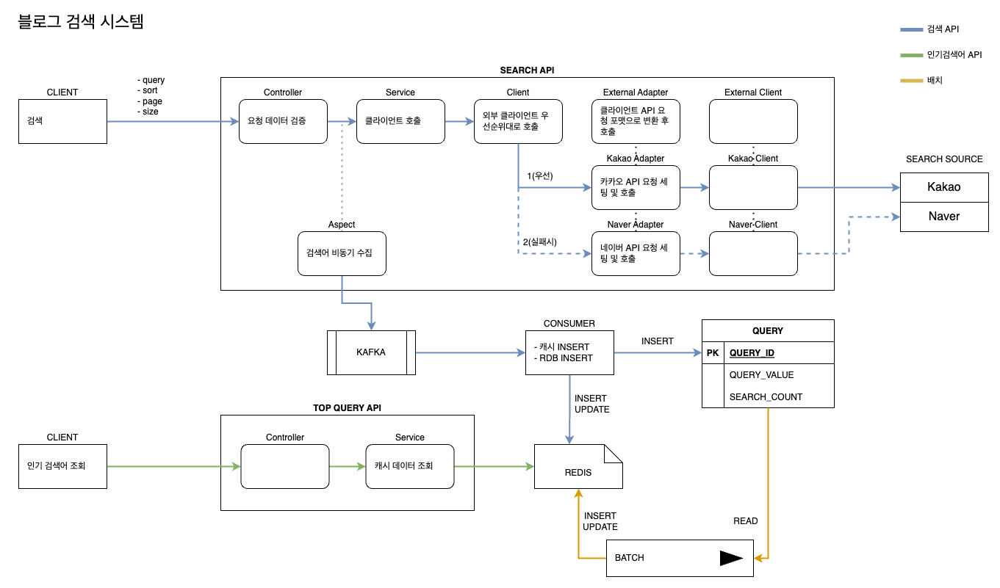

# 블로그 검색 서비스

카카오, 네이버의 블로그 검색 API를 활용해 블로그 검색 결과를 제공한다.

검색어를 수집하고, 수집 데이터를 활용해 인기 검색어를 제공한다.

<br>

## 프로젝트 정보

- Java 11
- Spring Boot 2.7.9
- H2 Database
- Spring Data JPA
- Gradle
- Dependencies
    - spring-data-jpa
    - spring-cloud-openfeign
    - swagger
    - lombok

<br>

## 실행 방법

1. 프로젝트의 [blog-search-0.0.1-SNAPSHOT.jar](https://github.com/infomuscle/blog-search/blob/main/blog-search-0.0.1-SNAPSHOT.jar) 다운로드
2. 터미널에서 파일 경로로 이동 후 `java -jar blog-search-0.0.1-SNAPSHOT.jar` 명령어 입력

<br>

## 시스템 설계



## API 명세

### 0. Swagger

- http://localhost:8080/swagger-ui/index.html
- 프로젝트 실행 후 위 링크에서 상세한 API 명세를 확인하실 수 있습니다.

<br>

### 1. 검색 API

- GET /blog/v1/search
- 요청 파라미터(json)

  | key   | 설명                                                     | 필수 | 예시     |
    | ----- | -------------------------------------------------------- | ---- | -------- |
  | query | 검색어                                                   | Y    | jpa      |
  | sort  | 정렬 기준. accuracy(정확도순), recency(최신순) 선택 가능 | Y    | accuracy |
  | page  | 페이지 번호                                              | Y    | 1        |
  | size  | 페이지 크기                                              | Y    | 10       |

- 응답 Body 샘플(json)

    ```json
    {
      "status": 200,
      "code": "0000",
      "message": "정상",
      "data": {
        "sort": "accuracy",
        "page": 1,
        "size": 10,
        "totalCount": 100,
        "totalPageCount": 10,
        "posts": [
          {
            "contents": "카카오뱅크 가고싶다",
            "postDate": "2023-03-22T00:00:00.000+00:00",
            "title": "오늘의 일기",
            "url": "https://bortfolio.tistory.com"
          }
        ]
      }
    }
    ```

- 핵심 기능(블로그 검색 결과 제공)

    - 다양한 검색 소스의 추가 고려
        - 외부 통신용 Feign Client는 공통 인터페이스 External Client를 구현
        - 검색 소스 API별 요청 데이터 형식이 다른 문제를 External Adapter로 해결
        - Service는 Client에만 의존
        - Client 내부적으로 컨텐츠 제공자 우선순위대로 호출
        - 성공시 결과를 Service로 반환하고 실패시 다음 컨텐츠 제공자 호출

- 부가 기능(데이터 수집 기능)

    - AOP로 핵심 서비스와 분리하여 수정, 확장, 오류 등에 독립성 확보

    - Kafka를 통한 DB 저장 우회

        - 목적 1: DB 처리 이슈로 검색 서비스 오류나 성능 저하 방지

        - 목적 2: 트래픽이 몰릴 경우 부하 분산

        - 참고: 실제 구현은 DB 직접 인서트/업데이트

    - 캐시/RDB 동시 인서트/업데이트

        - 목적: 인기 검색어의 실시간 정확도 향상

<br>

### 2. 인기 검색어 조회 API

- GET /blog/v1/search/queries/top

- 요청 파라미터 없음

- 응답 Body 샘플(json)

    ```json
    {
      "status": 200,
      "code": "0000",
      "message": "정상",
      "data": [
        {
          "query": "jpa",
          "searchCount": 100
        }
      ]
    }
    ```

- 핵심 기능(인기 검색어 조회)

    - RDB를 직접 호출하지 않고 캐시(인메모리 데이터베이스) 활용하여 성능 개선
    - 배치로 일정 주기마다 RDB 데이터를 인서트/업데이트

<br>

## 문제 해결 전략

### 1. 블로그 검색

- **키워드를 통한 블로그 검색**
    - 요청 파라미터 query를 받아 검색 소스 API 호출에 사용
- **검색 결과에서 Sorting(정확도순, 최신순) 기능을 지원**
    - 요청 파라미터 sort에서 accuracy(정확도순), recency(최신순)을 받아 검색 소스 API 호출에 사용
    - 각 검색 소스의 External Adapter에서 카카오, 네이버의 정확도순/최신순 파라미터 값으로 매핑
- **검색 결과는 Pagination 형태로 제공**
    - 요청 파라미터에서 page, sort를 받고 페이징 정보를 응답값의 page, size, totalCount, totalPageCount로 전달

- **검색 소스는 카카오 API**
    - Feign Client 이용해 카카오 API 호출
- **추후 카카오 API 이외에 새로운 검색 소스가 추가 고려**
    - External Client를 구현하는 검색 소스별 Feign Client로 확장성 고려
    - External Adapter로 검색 소스별 API 명세에 유연하게 대응 가능한 구조

<br>

### 2. 인기 검색어 목록

- **사용자들이 많이 검색한 순서대로, 최대 10개의 검색 키워드를 제공**
    - QUERY 테이블에서 검색횟수(SEARCH_COUNT) 역순으로 상위 10개 조회

- **검색어 별로 검색된 횟수 함께 표기**
    - 응답값에 searchCount 전달

<br>

### 3. 추가 요건

- **모듈 간 의존성 제약**
    - 상위 패키지에서 하위 패키지에 의존하지 않고 확장성을 갖도록 구조화
    - ex) external 패키지 내부에 kakao, naver 패키지를 갖고 있지만 각 패키지를 지워도 빌드 오류 없음
- **트래픽이 많고, 저장되어 있는 데이터가 많음을 염두에 둔 구현**
    - 배치로 일정 주기마다 QUERY의 상위 검색어를 Redis로 인서트/업데이트
- **동시성 이슈가 발생할 수 있는 부분을 염두에 둔 구현 (예시. 키워드 별로 검색된 횟수의 정확도)**
    - 인기 검색어 조회는 캐시 조회
    - 검색시 Redis, RDB 동시 인서트/업데이트하여 실시간 정확도
- **카카오 블로그 검색 API에 장애가 발생한 경우, 네이버 블로그 검색 API를 통해 데이터 제공**
    - Search Client에서 우선순위대로 External Client 호출
    - 성공하면 결과 반환, 실패하면 다음 External Client 호출하도록 구현

<br>

### 4. 예외 처리

- 비즈니스상 문제는 SearchBusinessException으로 구현
- SearchBuisnessException은 ApiResult Enum 포함
- 각 예외 케이스의 HTTP 상태, 응답 코드, 응답 메시지는 ApiResult에서 관리
- 핸들링되지 못한 예외는 Controller Advice에서 일괄 기타 예외 케이스로 매핑
    - Sentry 등 모니터링 적용하여 빠른 운영 이슈 발견

<br>

### 5. 테스트 케이스

- 통합 테스트(컨트롤러)
    - 검색 API
        - 성공
        - 필수 요청 파라미터 누락
        - 요청 파라미터 검증 실패
    - 인기 검색어 조회 API
        - 성공
- 단위 테스트(서비스)
    - search()
        - 성공
    - listTopQueries()
        - 성공
- 단위 테스트(클라이언트)
    - search()
        - 카카오 성공
        - 카카오 실패 후 네이버 성공
        - 카카오, 네이버 모두 실패
